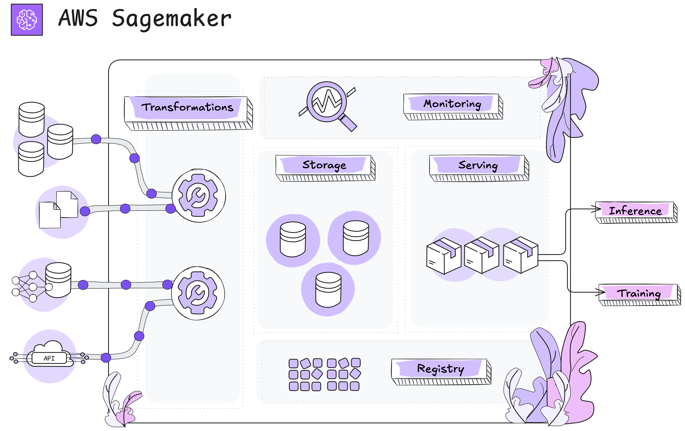
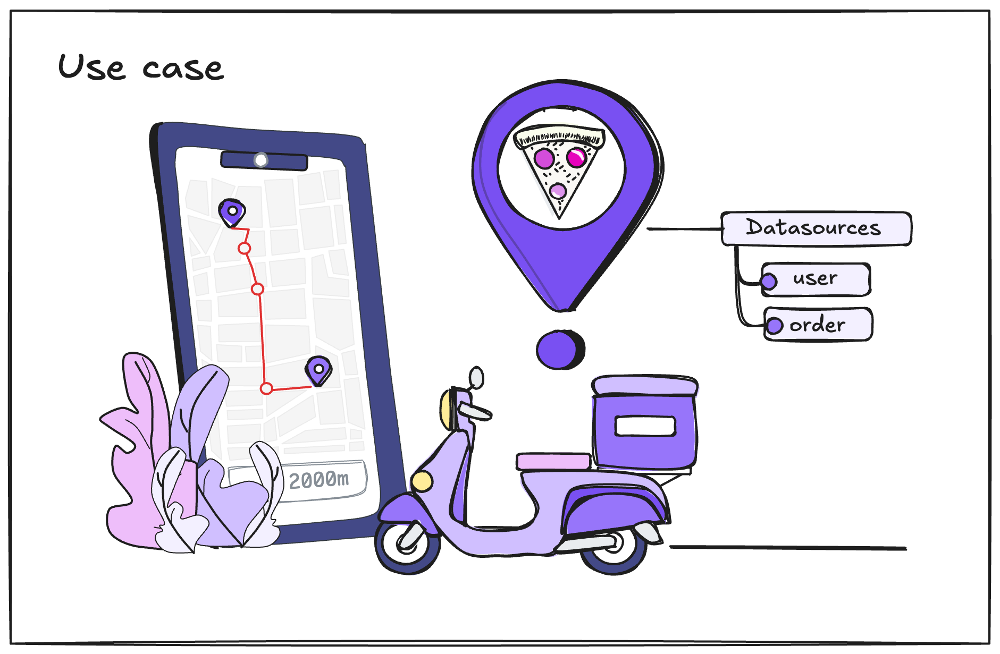

[](https://www.buymeacoffee.com/r0mymendez)

---

# **Feature Stores: A Key Component in Data Management for Machine Learning**  

## **Introduction**  
With the advancement of **Machine Learning (ML)** and **Generative AI**, developing models based on multiple data sources has become increasingly common. However, this growth also introduces new challenges: ensuring the security of training data, maintaining the traceability of features, and efficiently storing information in a scalable way.  

As ML models become more complex and demanding, there is a growing need for a solution that optimizes data management for training and deploying models reliably. In this context, **Feature Stores** have become a critical component for managing and reusing features in AI and ML projects.  



---

## **What is Feature Engineering?**  
**Feature Engineering** is the process of transforming raw data into variables (**features**) that can be used by machine learning models. This process is essential for improving model quality and performance since a well-designed feature selection and transformation can significantly impact prediction accuracy.  

The main stages of feature engineering include:  
* **Relevant Data Selection**: Identifying which variables or attributes are useful for the model.  
* **Data Cleaning and Preprocessing**: Handling missing values, removing noise, and normalizing data.  
* **Feature Transformation and Extraction**: Creating new features derived from the original data.  
* **Feature Storage and Reusability**: Efficiently saving features so they can be reused in different models and experiments.  

---


## **What is a Feature Store?**  
A **Feature Store** is a centralized repository designed to efficiently store, manage, and retrieve machine learning features. Its purpose is to optimize feature engineering, ensure consistency between training and inference, and promote feature reusability across different projects and teams.  

Feature Stores facilitate the integration between **data processing pipelines** and **AI models**, providing an abstraction layer that allows data scientists to access preprocessed features without having to repeat transformation tasks.  

### **Key Functions of a Feature Store**  


* 📦 **1. Centralized Repository**: Stores all features in a single repository, ensuring accessibility and reusability across different models and experiments. This improves team collaboration and avoids duplicated efforts in feature engineering.  
* 🔍 **2. Versioning**: Tracks different versions of features over time. This is essential for **ML experiment reproducibility**, ensuring that models can be rebuilt with the same features used in previous training runs.  
* 🔄 **3. Consistency**: Ensures that the same features are used across all stages of the ML workflow, from **training** to **production inference**. This minimizes errors and discrepancies between historical and real-time data.  
* 🚀 **4. Efficiency**: Optimizes feature engineering by enabling fast access to preprocessed data. This reduces the time required for data preparation and transformation, boosting productivity for data science teams and accelerating model development.  
* 📈 **5. Scalability**: Designed to handle **large volumes of data**, ensuring that features can grow in size and complexity without impacting system performance.  
* 🔌 **6. Integration**: Connects with various components of the **ML and MLOps ecosystem**, including **databases, data processing pipelines, model training platforms, and deployment systems**.  

---

## **Components of a Feature Store**  
A **Feature Store** consists of several key elements that help structure and manage machine learning features. The following sections illustrate these components, representing them as essential building blocks of the system.  


### **1. Feature Group**  
The **Feature Group** is the primary storage unit within a Feature Store and consists of:  
- **Feature Group**: A collection of related features describing a specific entity (e.g., "Users," "Transactions," "Products").  
- **Feature Definition**: The structured definition of each feature within the group, including its data type (numerical, categorical, etc.).  
- **Record**: A row within the feature group that represents a unique observation with its corresponding values.  

### **2. Record Details**  
Each record stored in a Feature Store contains key details that enable traceability and efficient management:  
- **Event Time**: Represents the timestamp when a record was generated or updated. This is critical for **data versioning** and tracking changes over time.  
- **Record Identifier Name**: A unique identifier that allows access to a specific record within the Feature Store.  

### **3. Storage Options**  
A Feature Store provides two types of storage based on the needs of the ML model:  
- **Online Storage**: Optimized for **real-time queries**, useful for applications requiring fast predictions (e.g., e-commerce recommendations).  
- **Offline Storage**: Used for **batch processing**, storing large volumes of historical data for **model training and analysis**.  

---

## Tutorial: Implementing a Feature Store for a Delivery Application Use Case 


Imagine we work for a company that has developed a **delivery application**, where we manage two key datasets:  
1. **User Data** – Contains customer details such as demographics and preferences.  
2. **Transaction Data** – Records orders, payment details, and delivery history.  

  


Due to challenges in **data management** faced by the **Data Science team**, we have decided to implement a **Feature Store**. This will allow us to **centralize, standardize, and efficiently store** user and transaction features, ensuring that they are:  
- **Easily accessible** for model training and inference.  
- **Consistent and up-to-date** across different machine learning workflows.  
- **Reusable** across multiple ML models without redundant preprocessing.  

In this tutorial, we will set up a **Feature Store** using **Amazon SageMaker**, enabling seamless integration with ML pipelines and improving the overall efficiency of data handling for predictive modeling.  

Now, let's review the **prerequisites** before we begin. 🚀

---

### ⚒ **Prerequisites**  

1. **Create a SageMaker Domain**  
2. **Launch a JupyterLab Python environment inside SageMaker Studio** (This step is optional, as the notebook can also be executed locally using AWS credentials to connect to the account. However, for simplicity, we will use this environment.)  
3. **Install dependencies after cloning the project** by running the following command:  

   ```bash
   !pip install -r requirements.txt
   ```
4. **Create an S3 Bucket and Upload DataFrames**  
   - Set up an **S3 bucket** to store the datasets.  
   - Upload the **DataFrames** located in the `"data"` folder to the created S3 bucket.

---

## 📄 Full Code 
All the code required to complete this tutorial can be found in the `main.ipynb` notebook.


